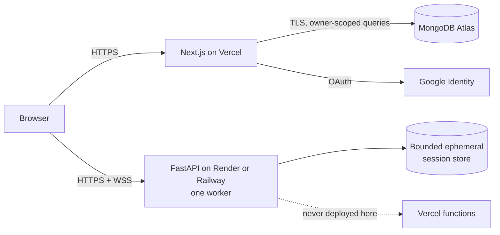

# SentinelOps Incident Lab

An evidence-first incident-response and observability learning platform built around safe, deterministic cloud simulations.

[Live web demo — add after verified Vercel deployment](#deployment) · [API status — add after verified Render/Railway deployment](#deployment) · [Two-minute demo script](docs/demo-script.md)

> Portfolio status: deployment-ready configuration is included, but this repository does not claim that a public deployment currently exists.

## Product summary

SentinelOps lets a learner receive a fictional incident, investigate bounded OpenTelemetry-shaped logs, metrics, and traces, collect evidence, test hypotheses, choose simulated mitigations, verify recovery, and generate a transparent scored report. Five deterministic built-in incidents and a private declarative scenario builder support repeated practice without connecting to real infrastructure.

The project is an independent educational portfolio. It is not an SRE certification, employment assessment, penetration-testing platform, production observability backend, or real incident-management system.

## Screenshots and demo media

The repository intentionally does not contain fabricated screenshots. Capture these from the final verified deployment:

| Asset                    | Recommended frame                                                            |
| ------------------------ | ---------------------------------------------------------------------------- |
| Hero screenshot          | Homepage hero plus system-safety statement, 1440×900                         |
| Investigation screenshot | Order service selected, metrics and topology visible, 1440×900               |
| Correlation screenshot   | Slow trace with related structured logs, 1440×900                            |
| Report screenshot        | Executive summary and score breakdown, 1440×900                              |
| Builder screenshot       | Private topology/timeline preview with validation status, 1440×900           |
| Demo GIF                 | 20–30 seconds: alert → metric → trace → log → evidence → rollback → recovery |

Store optimized media under `docs/assets/` and add descriptive alternative text before publishing.

## Major features

- Searchable scenario catalog and detailed commander briefings
- Five distinct deterministic incidents: latency, queues, memory, defensive authentication analysis, and cascading checkout failure
- Authoritative FastAPI state machine with pause, resume, step, speed, reset, TTL cleanup, idempotency, and bounded event history
- Capability-protected WebSocket telemetry batches with reconnection, snapshot resynchronization, and polling fallback
- Interactive service topology with a complete textual alternative
- Structured log explorer, metric dashboards with tables, trace waterfall and hierarchy, alert center, and deployment history
- Cross-tool correlation that preserves service, trace, deployment, and time context
- Evidence, annotations, hypotheses, safe simulated actions, recovery verification, deterministic scoring, replay, JSON/CSV export, and printable reports
- Google authentication with Auth.js, owner-scoped MongoDB Atlas history, dashboard, reports, preferences, and bounded persistence
- Private declarative scenario builder with safety validation, versioning, preview, duplication, archive, and private test runs
- Twelve-topic learning center and a resumable ten-step incident-response course

## Architecture



The Next.js application owns presentation, Auth.js, dashboard persistence, private scenarios, and learning progress. FastAPI exclusively owns active built-in simulation execution. It must run as one long-lived worker; active sessions are process-local and intentionally ephemeral. Atlas stores bounded summaries—not unlimited raw telemetry.

## Technology stack

| Layer          | Technology                                                                                                  |
| -------------- | ----------------------------------------------------------------------------------------------------------- |
| Web            | Next.js App Router, React, TypeScript, CSS, Vitest, Testing Library, Playwright                             |
| Simulation API | FastAPI, Pydantic, asyncio, Uvicorn, pytest, Ruff, MyPy                                                     |
| Real time      | Native WebSocket with versioned snapshots and batched events                                                |
| Identity       | Auth.js with Google OAuth and secure database sessions                                                      |
| Persistence    | MongoDB Atlas with TLS, pooling, owner-first indexes, TTL, and bounded documents                            |
| Deployment     | Vercel web; Render or Railway API; Docker API image                                                         |
| CI             | GitHub Actions for formatting, static analysis, tests, build, browser smoke, audits, and OpenAPI validation |

## Incident lifecycle

1. Select a scenario and read the simulated briefing.
2. Confirm impact, affected journey, environment, and initial alerts.
3. Inspect topology and correlate metrics, traces, logs, changes, and alerts.
4. Collect sourced evidence and build falsifiable hypotheses.
5. Review risk and apply a safe simulated mitigation.
6. Verify user-facing and mechanism signals through a stable window.
7. Submit an evidence-linked conclusion and incident documentation.
8. Review the deterministic score, missed evidence, lessons, and exact-version replay data.

## Built-in scenarios

| Scenario                      | Primary learning focus                                                   |
| ----------------------------- | ------------------------------------------------------------------------ |
| The Midnight Latency Incident | Deployment-correlated database connection retention and checkout latency |
| Queue at the Breaking Point   | Consumer slowdown, retry storm, backlog, and safe retry mitigation       |
| Memory Under Pressure         | Image-worker memory growth, restarts, rollback, and stable recovery      |
| The Authentication Storm      | Defensive analysis of simulated credential-stuffing-like traffic         |
| Cascading Checkout Failure    | Payment degradation, upstream timeout, and retry amplification           |

## Observability tools

Logs use safe structured fields such as `service.name`, `trace_id`, `span_id`, `deployment.version`, and `request_id`. Metrics cover traffic, errors, latency percentiles, CPU, memory, database connections, pool usage, queue depth, and restarts. Traces expose parent-child spans, critical path, attributes, and related logs without directly declaring hidden truth. Every visualization has a semantic text or table alternative.

## Safety model

- All services, organizations, deployments, telemetry, commits, and customer effects are fictional.
- No host scanning, shell commands, arbitrary Python/JavaScript, file access, network destinations, credentials, real hostnames, or infrastructure connections are supported.
- Custom scenarios are private declarative data interpreted by allowlisted code; they never become executable modules.
- State-changing actions only mutate deterministic simulation state and are recorded in the timeline.
- Hidden truth stays server-side until evidence and completion gates permit disclosure.

Read [the safety model](docs/safety-model.md), [threat model](docs/threat-model.md), and [security review](docs/security-review.md).

## Local setup

Requirements: Node.js 22+, pnpm 10+, Python 3.12+, and optionally an online MongoDB Atlas cluster plus Google OAuth client for authenticated persistence. Local MongoDB is neither required nor supported.

```bash
corepack enable
pnpm install --frozen-lockfile
python3.12 -m venv services/api/.venv
source services/api/.venv/bin/activate
pip install -e 'services/api[dev]'
cp .env.example .env
pnpm dev:web
pnpm dev:api
```

The web app runs at `http://localhost:3000`; FastAPI runs at `http://localhost:8000`. Development OpenAPI docs are at `http://localhost:8000/docs`.

## MongoDB Atlas setup

Create an Atlas database user, TLS `mongodb+srv` URI, non-production test database, and restricted network access. Put credentials only in uncommitted/provider environment variables. Create indexes with:

```bash
pnpm --filter @sentinelops/web db:indexes
```

Review the target database first; never run tests against production. See [the Atlas guide](docs/mongodb-atlas.md).

## Environment variables

| Variable                                    | Runtime    | Purpose                                           |
| ------------------------------------------- | ---------- | ------------------------------------------------- |
| `NEXT_PUBLIC_SITE_URL`                      | Web/build  | Canonical HTTPS web origin                        |
| `NEXT_PUBLIC_API_URL`                       | Web/build  | Render/Railway HTTPS API origin; WSS is derived   |
| `NEXT_PUBLIC_REPOSITORY_URL`                | Web/build  | Optional full GitHub repository URL               |
| `MONGODB_URI`                               | Web/server | TLS Atlas `mongodb+srv` URI                       |
| `MONGODB_DB_NAME`                           | Web/server | Atlas database name                               |
| `AUTH_SECRET`                               | Web/server | Strong Auth.js signing/session secret             |
| `AUTH_GOOGLE_ID` / `AUTH_GOOGLE_SECRET`     | Web/server | Google OAuth credentials                          |
| `AUTH_URL` / `AUTH_TRUST_HOST`              | Web/server | Canonical Auth.js production host settings        |
| `SENTINELOPS_ENVIRONMENT`                   | API        | `development`, `test`, `staging`, or `production` |
| `SENTINELOPS_CORS_ORIGINS`                  | API        | JSON array of exact allowed web origins           |
| `SENTINELOPS_LOG_LEVEL`                     | API        | Structured logging threshold                      |
| `SENTINELOPS_MAX_ACTIVE_SESSIONS`           | API        | Per-process capacity bound                        |
| `SENTINELOPS_SESSION_TTL_SECONDS`           | API        | Ephemeral session lifetime                        |
| `SENTINELOPS_SESSION_RATE_LIMIT_PER_MINUTE` | API        | Per-session request bound                         |

See [.env.example](.env.example) for safe placeholders. Never commit real credentials.

## Verification

```bash
corepack pnpm verify
corepack pnpm --filter @sentinelops/web test:e2e
cd services/api
.venv/bin/ruff format --check .
.venv/bin/python scripts/validate_openapi.py
cd ../..
corepack pnpm audit --prod --audit-level high
services/api/.venv/bin/pip-audit --local
```

Unit tests require neither Atlas nor external infrastructure. The Playwright smoke test starts local API and web processes and uses Chromium.

## Deployment

- **Vercel:** deploy the repository root using `vercel.json`; configure web, Auth.js, and Atlas variables.
- **Render:** apply `render.yaml`, set an exact HTTPS CORS allowlist, and retain one worker/instance.
- **Railway:** use `services/api` as service root with `railway.json`, one replica, and the same API variables.
- **Atlas:** configure TLS, network access, least-privilege credentials, and indexes before enabling persistence.

Full ordering, health checks, WebSocket validation, and troubleshooting are in [the deployment guide](docs/deployment.md). Configuration does not prove that a deployment succeeded.

## Accessibility

The application targets WCAG 2.2 AA practices with keyboard-operable controls, skip navigation, visible focus, semantic landmarks, labeled forms, error summaries, live alert announcements, data-table/chart alternatives, textual topology, reduced motion, responsive reflow, and text/icon status cues. See [the accessibility review](docs/accessibility.md). This is not a third-party conformance certification.

## Security

Security controls include secure Auth.js cookies, immutable ownership, IDOR tests, scalar query sanitization, safe redirects/sorts/pagination, capability-protected origin-checked WebSockets, strict production CORS, defensive headers, generic errors, validation redaction, bounded resources, CSV formula protection, declarative scenario safety, TLS Atlas access, and scheduled dependency audits.

Report vulnerabilities privately according to [SECURITY.md](SECURITY.md).

## Known limitations

- Active simulations are process-local and lost on API restart, deploy, sleep, or crash.
- The API supports one worker/replica and is not horizontally scalable in its current architecture.
- Ephemeral simulation sessions are capability-based and not Auth.js-owned; durable history remains owner-scoped in Next.js/Atlas.
- Local fallback is available only for the Midnight scenario and is not persistent.
- No multiplayer/team mode, public scenario marketplace, production collector, public certification, or mobile-native app exists.
- CSP retains inline script/style allowances required by the current Next.js output.
- Provider free tiers may sleep, terminate WebSockets, or change limits.

## Roadmap

Phases 1–10 are complete in repository scope. Potential future work includes a durable distributed simulation store, horizontally scalable session routing, team exercises, moderated scenario publishing, deeper browser accessibility automation, and provider-observed Web Vitals. No dates are promised. See [the roadmap](docs/roadmap.md).

## Project governance and license

Contributions follow [CONTRIBUTING.md](CONTRIBUTING.md) and the [Code of Conduct](CODE_OF_CONDUCT.md). Changes are recorded in [CHANGELOG.md](CHANGELOG.md). The project is available under the [MIT License](LICENSE).

## Independent-project disclaimer

SentinelOps Incident Lab is an independent portfolio project. It is not affiliated with, sponsored by, or endorsed by OpenTelemetry, Google, MongoDB, Vercel, Render, Railway, or any cloud, security, or observability vendor. Product and organization names inside scenarios are fictional.

## Agent-assisted development disclosure

This project was developed with substantial OpenAI Codex assistance for repository analysis, implementation, tests, documentation, and verification. Agent output was reviewed and validated as engineering input; maintainers remain responsible for all design, security, accessibility, deployment, and publication decisions. See [the full disclosure](docs/agent-assisted-development.md).
